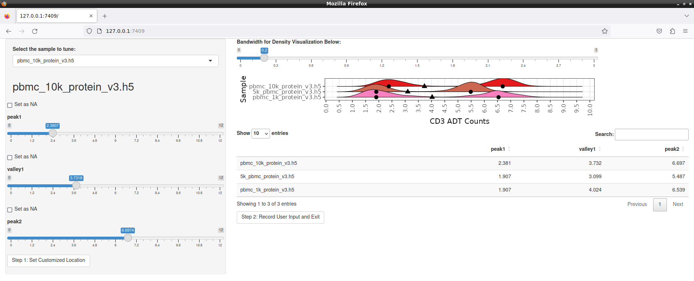

# ADTnormPy
ADTnorm is a package for CITE-seq batch-integration using landmark registration. 

ADTnormPy is a Python wrapper for the [ADTnorm](https://github.com/yezhengSTAT/ADTnorm) R package by [Ye Zheng](https://github.com/yezhengSTAT)! The preprint for ADTnorm can be found here: [Zheng et al. Robust Normalization and Integration of Single-cell Protein Expression across CITE-seq Datasets, bioRxiv, 2022](https://www.biorxiv.org/content/10.1101/2022.04.29.489989v1)

## Installation
This package wraps an R package, using rpy2. Therefore, installation of this package requires R is installed in your enviornment version 4.0.0 or greater. To install R into an isolated conda environment and to install ADTnorm in that R, you can use the following commands in terminal:

```
conda create -n ADTnormPy -c conda-forge r-base r-essentials rpy2
conda activate ADTnormPy
conda install ipykernel
python -m ipykernel install --user --name=ADTnormPy

R
install.packages("remotes")
remotes::install_github("yezhengSTAT/ADTnorm", build_vignettes = FALSE)
quit("no")
```
Alternatively, R can be downloaded and installed using [CRAN](https://cran.rstudio.com/), and ADTnorm can be installed following the instructions [here](https://github.com/yezhengSTAT/ADTnorm). Running ADTnormPy will also trigger a check that may successfully install the required R packages. Because ADTnorm has many dependencies, installation time may be slow.

Once R and ADTnorm are installed, you can install ADTnormPy. 
```
git clone https://github.com/donnafarberlab/ADTnormPy
cd ADTnormPy
conda activate ADTnormPy
python -m pip install .
```

## Usage
Once everything is installed, running ADTnorm is as simple as running: 
```python
adtnorm_df = adtnormpy.adtnorm(prot_df,
                         obs = obs,
                         sample_column='sample')
```
and you can provide on top of that any keyword arguments for ADTnorm [here](https://yezhengstat.github.io/ADTnorm/reference/ADTnorm.html).

This includes `marker_to_process` to limit normalization to one or a few markers, and many parameters to alter how normalization is performed inlcuding: `exclude_zeroes`, `peak_type`, `bimodal_marker`, `trimodal_marker`. 

There is also the ability to enable `save_fig` which will save figures of the pre- and post- normalized ADT expression distribution for each batch, and `save_landmark` which will save detected landmarks (peaks and valleys) in `.rds` format. If you use this, there are helper functions built-in to ADTnormPy for loading, converting, and saving these landmarks between R and Python. These can be passed to `override_landmark` to have more fine-tune control over landmark detection.

Using `customize_landmark=True` you can also activate the Shiny app for careful customization of landmarks.



**More examples of usage can be found in [this notebook](./ADTnormPyExampleUsage.ipynb).**

